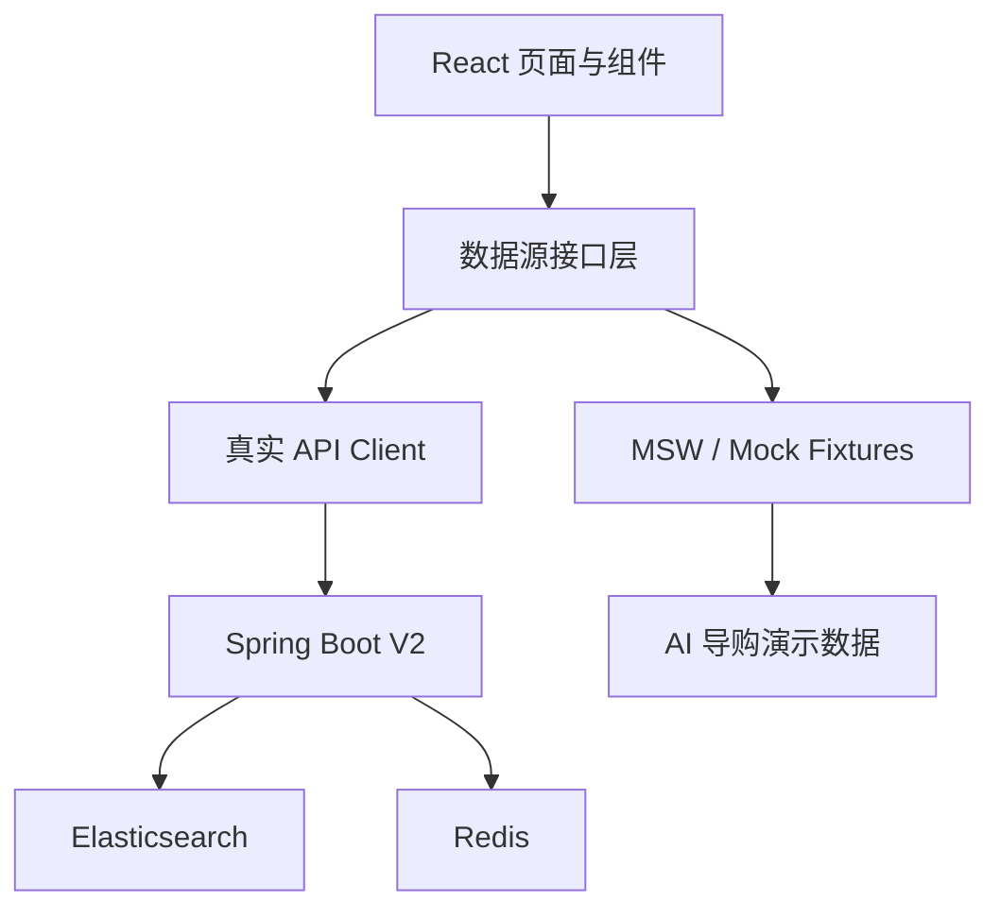

# AI 商品采购平台第二阶段前端系统设计文档（V2）

> 文档状态：待评审  
> 适用范围：ES 搜索、热销商品、浏览历史、AI 导购 Mock 原型  
> 技术栈：React、TypeScript、Ant Design、TanStack Query、MSW  
> 前置版本：`前端系统设计文档-V1.md`

## 1. 文档目的

本文定义第二阶段前端增量方案。V2 后端只建设 Elasticsearch 搜索、Redis 缓存、热销商品和浏览历史，不建设 AI 服务。前端可以按照 AI 商品采购原型图实现 AI 导购页面，但数据和交互全部由 Mock 层提供，用于提前验证页面结构、组件复用和交互流程。

V2 不重写第一阶段商城。传统搜索、商品详情、收藏和购物车继续使用现有能力；增强搜索、热销榜和浏览历史接入真实后端接口；AI 导购原型与真实业务 API 严格隔离。

## 2. 本阶段范围

### 2.1 真实后端能力

- 商品搜索切换到 Elasticsearch，保留关键词、分类、品牌、价格、库存和排序。
- 增加搜索联想、命中关键词高亮和筛选聚合。
- 首页和分类页展示 Redis 热销排行。
- 登录用户查看、删除和清空历史浏览记录。
- 游客在本地保存有限浏览历史，登录后由用户主动选择是否合并。
- 商品卡片可以展示“热销”标识，但不对外展示内部热度分数。

### 2.2 Mock 能力

- AI 导购页面和入口。
- 自然语言输入及模拟分析过程。
- 模拟提取品类、预算、品牌、场景和人群条件。
- 模拟推荐总结、商品卡片和推荐理由。
- 模拟多轮修改筛选条件。
- 正常、加载、无结果、失败等状态演示。

### 2.3 不在本阶段

- Python AI 微服务、大模型调用和 Prompt 管理。
- AI 会话、消息、推荐、反馈等后端表和 API。
- SSE 流式 AI 输出。
- AI 页面数据持久化、跨设备会话恢复。
- 订单、支付和基于真实订单的销量自动累计。
- 图片搜索、语音搜索和多模态识别。

## 3. 设计原则

1. **真假数据可识别**：AI 原型始终展示“演示数据”标识，不能让用户误认为已接入真实 AI。
2. **Mock 可替换**：页面只依赖 `AiShoppingDataSource` 接口，将来替换真实 API 时不重写组件。
3. **搜索真实可信**：ES 返回候选后，商品价格、库存和状态仍以 Spring Boot 返回结果为准。
4. **历史由用户控制**：浏览记录提供单条删除、全部清空和游客隐私提示。
5. **热销不伪装销量**：热销是销量、浏览量、收藏量的综合排序，不直接等同于销售排行榜。
6. **渐进增强**：ES 或 Redis 不可用时，页面仍可使用基础搜索和默认商品列表。

## 4. 前端总体架构



数据源分配：

| 功能 | 数据来源 |
| --- | --- |
| 搜索、筛选、联想 | Spring Boot V2 |
| 热销商品 | Spring Boot V2 |
| 登录用户浏览历史 | Spring Boot V2 |
| 游客浏览历史 | 浏览器本地存储 |
| 商品详情、收藏、购物车 | 现有 Spring Boot V1 API |
| AI 导购 | MSW / 本地 Fixture |

## 5. 路由设计

| 路由 | 权限 | 数据来源 | 说明 |
| --- | --- | --- | --- |
| `/` | 公开 | 真实 API | 首页热销和最近浏览 |
| `/products` | 公开 | 真实 API | ES 商品搜索结果 |
| `/products/:id` | 公开 | 真实 API | 商品详情并记录浏览 |
| `/history` | 登录用户 | 真实 API | 完整浏览历史 |
| `/ai-search-demo` | 公开或灰度 | Mock | AI 导购演示页 |

若保留 `/ai-search` 路由，应重定向到 `/ai-search-demo`，并由 `VITE_AI_DEMO_ENABLED` 控制入口。

## 6. 搜索页面设计

### 6.1 页面结构

```text
搜索框 + 搜索建议
已选筛选条件 Chips
分类 / 品牌 / 价格 / 库存筛选
结果数量 + 排序方式
商品结果网格
分页
```

### 6.2 搜索能力

- 输入关键词后 250ms 防抖请求搜索建议。
- 按 Enter 或点击搜索后更新 URL Query String。
- URL 保存 `keyword`、`categoryId`、`brandId`、`minPrice`、`maxPrice`、`inStock`、`sort` 和 `page`。
- 页面刷新、分享链接和浏览器前进后退均能恢复条件。
- ES 聚合返回可用分类、品牌及对应结果数；前端不从当前页自行统计。
- 命中高亮只渲染后端允许的 `<em>` 标记，其他 HTML 全部转义。
- 修改筛选条件后回到第 1 页。
- 搜索结果为空时提供移除价格或品牌条件的建议。

### 6.3 排序

| 值 | 展示名称 |
| --- | --- |
| `RELEVANCE` | 综合相关度 |
| `PRICE_ASC` | 价格从低到高 |
| `PRICE_DESC` | 价格从高到低 |
| `NEWEST` | 最新上架 |
| `HOT` | 热销优先 |

没有关键词时，`RELEVANCE` 由后端转换为默认排序。前端不得自行组合热度权重。

### 6.4 搜索建议

建议类型包括：

- 历史搜索词：仅在用户本地展示，可单独清除。
- 商品名称建议：来自后端 ES Suggest 接口。
- 分类和品牌建议：来自后端结构化建议。

建议请求失败不影响用户提交完整关键词搜索。

## 7. 热销商品设计

### 7.1 展示位置

- 首页“热销推荐”：全站热销前 8 条。
- 分类页“本类热销”：当前分类前 8 条。
- 商品详情“大家都在看”：同分类热销，排除当前商品。
- 搜索排序中的“热销优先”。

### 7.2 展示规则

- 卡片显示“热销”标签、商品信息、价格和库存状态。
- 不展示内部 `hotScore`，避免用户误解分数含义。
- 如确需社会证明，可展示后端明确提供的“近期浏览”“收藏人数”等文案，禁止前端拼造。
- 下架、删除和无库存商品按后端规则剔除。
- Redis 降级时不显示错误弹窗，只在全局诊断信息中记录。

## 8. 浏览历史设计

### 8.1 记录时机

商品详情成功加载且页面可见后记录一次浏览。前端调用浏览上报接口并携带本次页面访问生成的 `clientViewId`。为避免开发环境 React StrictMode 或快速刷新造成重复，前端在同一页面停留周期内仅上报一次；服务端继续执行幂等和时间窗口去重。

### 8.2 登录用户

- 详情页调用 `POST /api/v2/browsing-history/{productId}`；登录用户同时更新个人历史。
- 首页展示最近浏览横向列表，最多 8 条。
- `/history` 按最近浏览时间倒序、游标分页。
- 支持删除单条和清空全部，清空操作需要二次确认。
- 下架商品可以保留历史记录，但必须显示不可购买状态。

### 8.3 游客

- 使用 `localStorage` 保存最近 20 个商品 ID、最近时间和必要的版本字段。
- 仍调用浏览上报接口用于匿名聚合统计，服务端通过签名匿名标识去重，但不会为游客创建服务端历史列表。
- 不在本地复制完整商品详情，展示时批量请求当前商品摘要。
- 用户可随时关闭本地历史或清空。
- 登录后弹出一次非强制提示，由用户选择是否合并到账号；未经确认不自动上传。

### 8.4 隐私体验

- 个人中心提供“浏览历史”入口。
- 页面说明浏览历史用于继续浏览和热销统计。
- 删除个人历史后，历史列表不可恢复；已经进入匿名聚合指标的数据按统计保留策略处理。
- 埋点和错误日志不记录用户完整搜索内容。

## 9. AI 导购 Mock 原型

### 9.1 目标

AI Mock 页用于验证产品交互，不代表 V2 已实现 AI 能力。页面必须固定展示：

> AI 导购交互原型 · 当前结果为演示数据

### 9.2 页面结构

```text
演示标识
自然语言输入框 + 示例问题
模拟分析步骤
识别条件 Chips
筛选面板
推荐说明
商品卡片 + Mock 推荐理由
重新开始
```

### 9.3 Mock 场景

至少提供以下固定场景：

1. “想买旅行用相机，预算 500 以内”。
2. “适合办公室吃的低糖零食，100 元以内”。
3. “给一岁以上猫吃的猫粮”。
4. 无匹配结果。
5. 模拟服务失败。

Mock 解析采用关键词和固定 Fixture 映射，不调用后端、不访问大模型。推荐商品可以引用本地测试商品 ID，但推荐理由、匹配度和条件均属于演示数据。

### 9.4 可替换数据源

```ts
export interface AiShoppingDataSource {
  submit(input: AiDemoRequest): Promise<AiDemoResponse>;
  refine(input: AiDemoRefineRequest): Promise<AiDemoResponse>;
  reset(): void;
}

export class MockAiShoppingDataSource implements AiShoppingDataSource {
  // V2 实现
}
```

未来接入真实 AI 时新增 `HttpAiShoppingDataSource`，页面组件和展示模型保持稳定。V2 不提前定义真实 AI 后端 URL。

## 10. 核心组件

| 组件 | 职责 | 数据来源 |
| --- | --- | --- |
| `SearchBox` | 搜索输入、历史词和建议 | 真实 API + 本地 |
| `SearchSuggestionPanel` | 商品、分类、品牌建议 | 真实 API |
| `SearchFilters` | 筛选及聚合数量 | 真实 API |
| `SearchResultGrid` | ES 搜索结果 | 真实 API |
| `HotProductSection` | 全局或分类热销 | 真实 API |
| `RecentViewedSection` | 首页最近浏览 | 混合 |
| `BrowsingHistoryPage` | 历史列表、删除、清空 | 真实 API |
| `ProductCard` | 商品展示、收藏、加购 | 复用 V1 |
| `AiDemoPage` | AI 原型页面 | Mock |
| `AiDemoComposer` | 演示问题输入 | Mock |
| `AiDemoIntentChips` | 演示解析条件 | Mock |
| `AiDemoRecommendationGrid` | 演示推荐结果 | Mock |

## 11. 前端数据模型

```ts
type SearchParams = {
  keyword?: string;
  categoryId?: string;
  brandId?: string;
  minPrice?: string;
  maxPrice?: string;
  inStock?: boolean;
  sort?: 'RELEVANCE' | 'PRICE_ASC' | 'PRICE_DESC' | 'NEWEST' | 'HOT';
  page?: number;
  pageSize?: number;
};

type SearchResponse = {
  items: ProductSummary[];
  total: number;
  page: number;
  pageSize: number;
  tookMs?: number;
  degraded: boolean;
  facets: {
    categories: FacetItem[];
    brands: FacetItem[];
  };
};

type BrowsingHistoryItem = {
  id: string;
  product: ProductSummary;
  lastViewedAt: string;
  viewCount: number;
};

type HotProduct = ProductSummary & {
  hotLabel?: string;
};

type AiDemoResponse = {
  mock: true;
  summary: string;
  intent: Record<string, unknown>;
  recommendations: Array<{
    product: ProductSummary;
    reason: string;
  }>;
};
```

## 12. 真实 API 契约

| 方法 | 路径 | 用途 |
| --- | --- | --- |
| `GET` | `/api/v2/products/search` | ES 商品搜索与聚合 |
| `GET` | `/api/v2/products/search/suggestions` | 搜索建议 |
| `GET` | `/api/v2/products/hot` | 全局或分类热销 |
| `POST` | `/api/v2/browsing-history/{productId}` | 记录有效浏览；登录用户同时更新个人历史 |
| `GET` | `/api/v2/browsing-history` | 查询浏览历史 |
| `DELETE` | `/api/v2/browsing-history/{productId}` | 删除单个商品历史 |
| `DELETE` | `/api/v2/browsing-history` | 清空历史 |
| `POST` | `/api/v2/browsing-history:merge` | 用户确认后合并游客历史 |
| `POST` | `/api/v2/products:batch-summary` | 游客历史批量查询商品摘要 |

V1 `/products` 和 `/products/hot` 可以保持兼容并在后端委托给新实现；前端新代码优先使用明确的 V2 接口。

## 13. 状态管理与缓存

建议 Query Key：

```ts
['product-search', normalizedSearchParams]
['search-suggestions', keyword]
['hot-products', categoryId, limit]
['browsing-history', cursor]
['recent-viewed']
```

- 搜索结果保留上一页数据，换页时显示轻量加载状态。
- 搜索建议使用短 `staleTime`，空关键词不发请求。
- 热销列表可缓存 1~5 分钟，但页面重新聚焦时无需强制刷新。
- 新增或删除收藏后使相关热销查询失效不是硬要求，热销榜按后端周期刷新。
- 删除浏览历史后立即乐观更新列表，失败则回滚并提示。
- AI Mock 状态只存在于页面内存，不写入服务端 Query Cache。

## 14. 工程结构

```text
frontend/apps/mall-web/src/
├── features/search/
│   ├── api/searchApi.ts
│   ├── components/SearchFilters.tsx
│   ├── components/SearchSuggestionPanel.tsx
│   └── pages/ProductSearchPage.tsx
├── features/hot-products/
│   ├── api/hotProductApi.ts
│   └── components/HotProductSection.tsx
├── features/browsing-history/
│   ├── api/browsingHistoryApi.ts
│   ├── storage/guestHistoryStorage.ts
│   ├── components/RecentViewedSection.tsx
│   └── pages/BrowsingHistoryPage.tsx
└── features/ai-demo/
    ├── data/fixtures.ts
    ├── data/MockAiShoppingDataSource.ts
    ├── components/
    └── pages/AiDemoPage.tsx
```

若项目采用 MSW，Handler 放入统一 `mocks/handlers`，仅在 `VITE_MOCK_AI_DEMO=true` 时启用，禁止拦截真实搜索和浏览历史 API。

## 15. 功能开关

```env
VITE_SEARCH_V2_ENABLED=true
VITE_BROWSING_HISTORY_ENABLED=true
VITE_AI_DEMO_ENABLED=true
VITE_MOCK_AI_DEMO=true
```

- `VITE_AI_DEMO_ENABLED=false` 时完全隐藏 AI 原型入口。
- `VITE_MOCK_AI_DEMO` 只能在开发、测试或明确的演示环境打开。
- 生产环境如果开放演示页，必须保留醒目的 Mock 标识。
- 功能开关不替代服务端权限控制。

## 16. 异常与降级

| 场景 | 前端行为 |
| --- | --- |
| ES 降级到 MySQL | 正常展示结果，可显示“基础搜索模式”轻提示 |
| 搜索建议失败 | 收起建议面板，仍允许提交搜索 |
| Redis 热销不可用 | 展示后端降级列表或隐藏该区块 |
| 浏览记录写入失败 | 不阻塞商品详情，静默重试一次后记录诊断信息 |
| 历史列表失败 | 显示重试，其他个人中心能力可用 |
| Mock 场景无匹配 | 展示固定无结果原型状态 |

## 17. 安全与隐私

- 继续使用 HttpOnly Cookie，不在本地保存访问令牌。
- 搜索高亮按受控标记渲染，禁止 `dangerouslySetInnerHTML` 直接接收任意内容。
- 游客历史只保存商品 ID 和时间，不保存账号、地址等信息。
- 合并游客历史必须由用户主动确认。
- 清空历史提供确认框并准确描述影响范围。
- AI Mock 文本按照普通文本渲染，不执行 HTML。

## 18. 埋点

| 事件 | 主要字段 |
| --- | --- |
| `search_submit` | 条件类型、结果数、是否降级 |
| `search_suggestion_click` | 建议类型、位置 |
| `search_product_click` | 商品 ID、结果位置 |
| `hot_product_impression` | 场景、商品 ID、排名 |
| `hot_product_click` | 场景、商品 ID、排名 |
| `history_product_click` | 商品 ID、入口 |
| `history_clear` | 条数、用户确认 |
| `ai_demo_submit` | 固定场景标识，不记录自由文本 |

浏览量只由带 `clientViewId` 的浏览上报接口产生；普通分析埋点不参与业务浏览量，避免重复累计。

## 19. 测试策略

### 19.1 单元与组件测试

- URL 与搜索参数双向映射。
- 搜索建议防抖、取消和键盘操作。
- 聚合筛选、价格校验和高亮安全渲染。
- 游客历史去重、上限、清除和主动合并。
- 登录历史删除和清空的乐观更新回滚。
- AI Mock 固定场景、无结果、失败和演示标识。
- 确认 AI Mock 不发出真实 AI 网络请求。

### 19.2 端到端测试

1. 搜索“苹果”并结合价格、分类筛选得到真实商品。
2. 搜索条件刷新后仍可恢复。
3. 访问多个详情后，登录用户历史按最后访问时间排序。
4. 删除单条和清空历史成功。
5. 首页和分类页展示对应热销商品。
6. Redis 不可用时首页仍可访问。
7. ES 不可用时搜索进入基础模式。
8. AI 演示页始终显示 Mock 标识且不依赖后端 AI。

## 20. 性能目标

- 搜索页路由按需加载，不增加首页主包中的 AI Demo 代码。
- 搜索建议输入后 250ms 防抖，旧请求可取消。
- 商品图片懒加载，搜索首屏默认 20 条以内。
- 浏览历史使用游标分页，首页最近浏览不超过 8 条。
- AI Demo Fixture 按场景懒加载，避免打入商城公共包。

## 21. 发布顺序

1. 后端先部署 V2 API，保留 V1 搜索降级。
2. 前端接入 ES 搜索和热销接口，通过开关灰度。
3. 上线登录用户浏览历史，再开放游客本地历史及合并。
4. AI Mock 原型仅在开发或评审环境开放。
5. 异常时关闭 V2 搜索开关或 AI Demo 入口，V1 商城继续可用。

## 22. V2 前端验收标准

- 搜索结果支持关键词、筛选、聚合、排序、分页和 URL 恢复。
- 搜索建议失败不影响正式搜索。
- 首页、分类页和详情页正确展示热销商品。
- 登录用户能够查询、删除和清空历史浏览。
- 游客历史仅保存在本地，并在确认后才能合并。
- 浏览记录不因 React 重复渲染被前端重复上报。
- AI 导购原型完全使用 Mock 数据并始终标识为演示。
- V2 不调用任何 Python AI 服务或 AI 后端 API。
- ES 或 Redis 异常时，传统商城核心能力仍可使用。

## 23. 待评审事项

- AI Mock 页是否只允许开发/测试环境访问。
- 游客历史保留 20 条是否满足产品体验。
- 登录用户浏览历史的产品保留天数。
- 搜索结果是否向用户显示“近期浏览量”或仅显示热销标签。
- 热销区块在 Redis 和 MySQL 降级均失败时隐藏还是显示最新商品。
