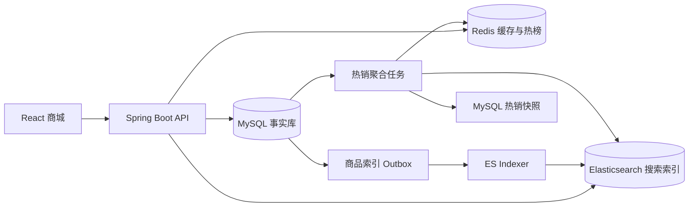
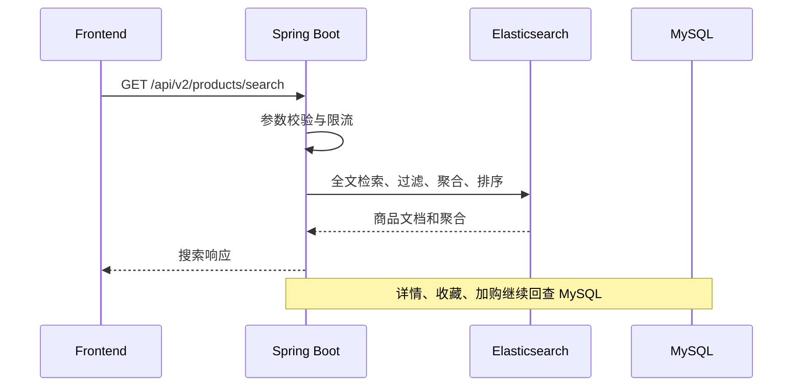
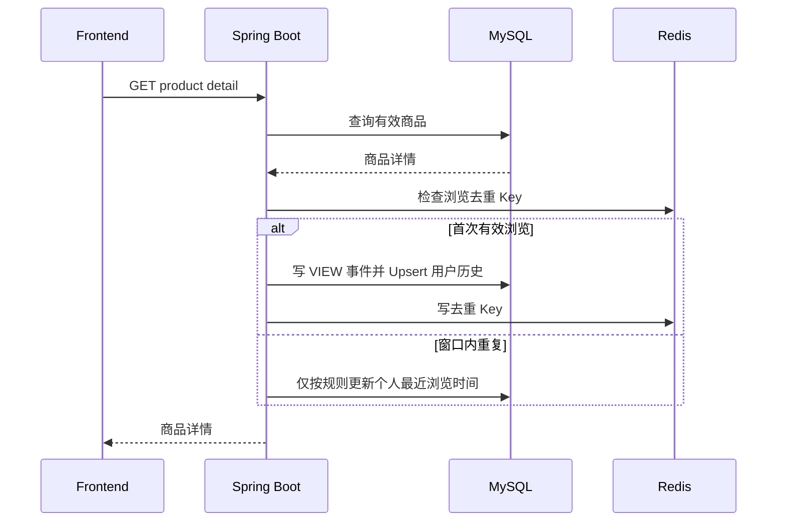
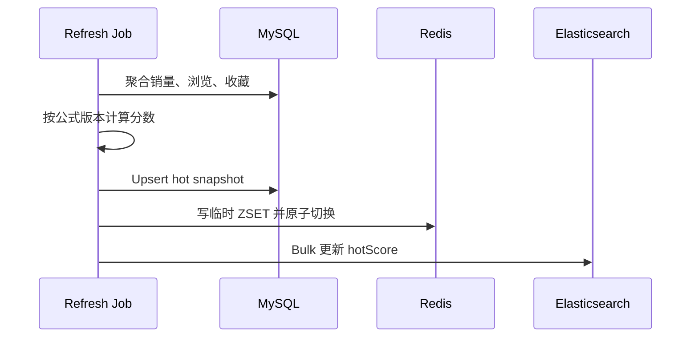

# AI 商品采购平台第二阶段后端系统设计文档（V2）

> 文档状态：待评审  
> 适用范围：Elasticsearch 搜索、Redis 缓存、浏览历史、热销排行  
> 技术栈：Spring Boot、MySQL、Elasticsearch、Redis、Docker  
> 前置版本：`后端系统设计文档-V1.md`

## 1. 文档目的

本文定义第二阶段后端增量设计。V2 聚焦搜索和用户行为数据基础设施：使用 Elasticsearch 增强商品搜索，使用 Redis 缓存热销榜和热点商品，新增可供用户查询与管理的历史浏览功能，并以销量、浏览量、收藏量共同计算热销排行。

本阶段明确不建设 AI 后端，不新增 Python 服务、AI 会话表、模型调用、Prompt、推荐理由或 SSE AI 接口。前端 AI 导购原型只使用 Mock 数据，与本后端无调用关系。

## 2. 建设范围

### 2.1 本阶段包含

- 商品数据从 MySQL 可靠同步到 Elasticsearch。
- 商品全文检索、属性筛选、聚合、排序、联想和高亮。
- ES 异常时降级到 V1 MySQL 基础搜索。
- 登录用户历史浏览记录、查询、单条删除和清空。
- 游客浏览行为去重统计；游客历史列表主要保存在前端本地。
- 用户确认后的游客历史合并。
- 销量、浏览量、收藏量的来源定义和聚合。
- 全局及分类热销排行计算。
- Redis 热销 Sorted Set、热点商品摘要和搜索建议短缓存。
- Redis 异常时降级到 MySQL 热销快照。
- Docker Compose 增加 ES 和 Redis。

### 2.2 本阶段不包含

- Python AI 微服务和任何大模型调用。
- AI 会话、消息、推荐、反馈及模型运行记录。
- 自然语言意图解析、语义重排和推荐理由。
- PostgreSQL、Kafka、复杂 CDC 平台或分布式事务。
- 订单、支付和履约系统。
- 把加购量、测试点击量冒充真实销量。
- 向量检索；可预留映射但不在 V2 验收范围内。

## 3. 核心原则

1. **MySQL 是事实来源**：商品、行为事件、浏览历史、销量导入和热销快照以 MySQL 为准。
2. **ES 是搜索读模型**：ES 数据允许短暂延迟，不能成为商品管理写库。
3. **Redis 是派生缓存**：所有 Redis 数据都能够从 MySQL 重建。
4. **热销可解释**：销量、浏览量、收藏量均有明确统计口径、窗口和权重。
5. **历史与统计分离**：用户可删除的浏览历史不等于匿名化的聚合指标。
6. **无 AI 暗依赖**：后端服务不定义空壳 AI API，也不要求 Python 服务才能启动。
7. **兼容 V1**：ES 或 Redis 故障时，传统商城仍能工作。

## 4. 总体架构



数据职责：

| 数据 | 事实来源 | 派生存储 |
| --- | --- | --- |
| 商品、价格、库存、状态 | MySQL `products` | ES、Redis 商品摘要 |
| 浏览事件 | MySQL `product_events` | 日聚合、热销快照、Redis |
| 用户浏览历史 | MySQL `user_browsing_history` | 无必要缓存 |
| 收藏关系 | MySQL `favorites` | 热销快照、Redis |
| 销量 | MySQL 销量日表 | 热销快照、Redis、ES `hotScore` |
| 搜索结果 | ES | 可选短缓存，不作为事实数据 |

## 5. 技术选型

| 领域 | 选型 | 说明 |
| --- | --- | --- |
| 业务服务 | Spring Boot | 沿用 V1 单体，增加模块实现 |
| 主数据库 | MySQL 8 | 业务事实、事件、历史和快照 |
| 搜索 | Elasticsearch 8 | 中文全文检索、过滤、聚合和排序 |
| 缓存 | Redis 7 | 热销 ZSET、热点摘要、限流和短缓存 |
| 数据迁移 | Flyway | V2 表、索引和基础数据 |
| 测试 | JUnit、Testcontainers | MySQL、ES、Redis 集成测试 |
| 部署 | Docker Compose | 开发、联调和演示环境 |

V2 不引入消息队列。商品索引同步使用 MySQL Outbox + Spring 定时任务；未来事件量达到瓶颈后再评估 Kafka 或 CDC。

## 6. 模块设计

```text
backend/src/main/java/com/aishop/commerce/
├── search/
│   ├── ProductSearchService.java
│   ├── MysqlProductSearchService.java
│   ├── ElasticsearchProductSearchService.java
│   ├── ProductSearchQuery.java
│   ├── ProductSearchResult.java
│   ├── SearchSuggestionService.java
│   └── index/
│       ├── ProductIndexDocument.java
│       ├── ProductIndexMapper.java
│       ├── ProductIndexOutboxPublisher.java
│       └── ProductIndexRebuildService.java
├── browsinghistory/
│   ├── BrowsingHistoryController.java
│   ├── BrowsingHistoryService.java
│   ├── BrowsingHistoryRepository.java
│   └── BrowsingHistoryDtos.java
├── productmetrics/
│   ├── ProductEventService.java
│   ├── ProductMetricAggregationJob.java
│   └── ProductSalesImportService.java
├── hotproduct/
│   ├── HotProductService.java
│   ├── RedisHotProductService.java
│   ├── MysqlHotProductFallbackService.java
│   ├── HotScoreCalculator.java
│   └── HotProductRefreshJob.java
└── cache/
    ├── ProductSummaryCache.java
    └── CacheKeyFactory.java
```

`ProductSearchService` 和 `HotProductService` 继续保持接口抽象。Controller 不依赖 ES 或 Redis 客户端，便于故障时切换实现。

## 7. Elasticsearch 商品搜索

### 7.1 索引命名

- 读别名：`products_search`
- 写别名：`products_search_write`
- 实体索引：`products_search_v{schemaVersion}_{timestamp}`

应用只访问别名。全量重建时创建新实体索引，校验后原子切换别名，旧索引保留一个发布周期用于回滚。

### 7.2 商品文档

```json
{
  "productId": 10001,
  "productNo": "FOOD-APPLE-001",
  "name": "红富士苹果",
  "subtitle": "脆甜多汁",
  "description": "...",
  "categoryId": 101,
  "categoryPathIds": [1, 101],
  "brandId": 12,
  "brandName": "示例品牌",
  "salePrice": 29.90,
  "stock": 84,
  "status": "ON_SALE",
  "deleted": false,
  "keywords": ["苹果", "水果"],
  "scenarios": ["日常", "送礼"],
  "audiences": ["家庭"],
  "specifications": {"净含量": "2kg"},
  "publishedAt": "2026-07-20T10:00:00+08:00",
  "hotScore": 0.873521,
  "version": 7,
  "updatedAt": "2026-07-21T10:00:00+08:00"
}
```

### 7.3 Mapping 原则

- 名称、关键词、副标题和描述使用适合中文的 analyzer，并保留 keyword 子字段。
- 商品编号、分类、品牌、状态、场景、人群使用精确字段。
- 价格使用 `scaled_float` 或能准确表达两位小数的数值类型。
- `specifications` 使用受控对象或 flattened，避免动态字段爆炸。
- `hotScore` 用于 ES 的热销排序，由热销任务定期批量更新。
- `version` 防止旧 Outbox 事件覆盖新商品文档。
- V2 不存储或查询向量字段。

中文分词器必须在 Docker 和目标环境保持一致。若使用第三方插件，需要固定 ES 版本并在镜像构建时安装，不能在容器启动时临时下载。

## 8. 搜索查询设计

### 8.1 查询条件

```java
public record ProductSearchQuery(
    String keyword,
    Long categoryId,
    Long brandId,
    BigDecimal minPrice,
    BigDecimal maxPrice,
    Boolean inStock,
    ProductSort sort,
    int page,
    int pageSize
) {}
```

校验规则：

- `page >= 1`，`pageSize` 默认 20、最大 100。
- 价格不得为负，最小价不得大于最大价。
- 分类和品牌 ID 必须为合法数值。
- 关键词去除首尾空白并限制长度。
- 排序只能使用白名单枚举。
- C 端始终增加 `status=ON_SALE`、`deleted=false` 过滤。

### 8.2 相关度

- 商品名称权重最高。
- 关键词和品牌次之。
- 副标题和描述权重较低。
- 分类、品牌、价格、库存进入 filter，不参与文本相关度。
- 拼写模糊只对一定长度的关键词开启，防止短词产生大量误召回。
- 同义词使用受控词库，例如“充电宝/移动电源”“纸巾/抽纸”。

### 8.3 聚合

ES 返回当前查询范围内的分类和品牌 Bucket 及数量。已选择筛选项仍需保留在响应中，避免页面因零结果无法撤销筛选。

### 8.4 高亮

仅允许 ES 使用固定 `<em>` 和 `</em>` 标签，Spring Boot 对片段长度和标签再次清洗。前端不得接收任意 HTML。

### 8.5 排序

| 枚举 | ES 排序 |
| --- | --- |
| `RELEVANCE` | `_score desc`；无关键词时转默认排序 |
| `PRICE_ASC` | `salePrice asc, productId desc` |
| `PRICE_DESC` | `salePrice desc, productId desc` |
| `NEWEST` | `publishedAt desc, productId desc` |
| `HOT` | `hotScore desc, productId desc` |

热销排序使用最近一次热销快照分数，前端不能自行重排。

## 9. 搜索 API

### 9.1 商品搜索

```http
GET /api/v2/products/search?keyword=苹果&maxPrice=30&sort=RELEVANCE&page=1&pageSize=20
```

响应核心结构：

```json
{
  "code": "OK",
  "data": {
    "items": [],
    "total": 12,
    "page": 1,
    "pageSize": 20,
    "tookMs": 36,
    "degraded": false,
    "facets": {
      "categories": [{"id": "101", "name": "水果", "count": 8}],
      "brands": [{"id": "12", "name": "示例品牌", "count": 5}]
    }
  },
  "requestId": "req_01J..."
}
```

### 9.2 搜索建议

```http
GET /api/v2/products/search/suggestions?keyword=苹&limit=8
```

返回商品名称、分类和品牌类型的建议。关键词少于约定长度时可以返回空，接口必须限流。

### 9.3 批量商品摘要

```http
POST /api/v2/products:batch-summary
```

用于游客本地浏览历史回查当前商品信息。单次商品 ID 数量设置上限，保持请求顺序或明确返回 ID 映射。

### 9.4 V1 兼容

- 原 `GET /products` 可通过配置切换到 `ElasticsearchProductSearchService`。
- 原 `GET /products/hot` 委托新的热销服务。
- V2 接口提供聚合、建议、降级标记等增强字段。
- 切换失败时可关闭 `SEARCH_ES_ENABLED` 恢复 MySQL 实现。

## 10. 商品索引同步

### 10.1 `product_search_outbox`

| 字段 | 类型 | 说明 |
| --- | --- | --- |
| `id` | `BIGINT` | 递增主键 |
| `product_id` | `BIGINT` | 商品 ID |
| `event_type` | `VARCHAR(20)` | UPSERT/DELETE |
| `product_version` | `BIGINT` | 商品版本 |
| `status` | `VARCHAR(20)` | NEW/PROCESSING/DONE/FAILED |
| `retry_count` | `INT` | 重试次数 |
| `next_retry_at` | `DATETIME(3)` | 下次重试时间 |
| `last_error` | `VARCHAR(500)` | 截断后的错误信息 |
| `created_at/processed_at` | `DATETIME(3)` | 时间 |

商品新增、编辑、上下架和逻辑删除时，在同一个 MySQL 事务中写入 Outbox。事务提交后不直接保证 ES 已完成更新。

### 10.2 增量处理

1. Indexer 使用 `FOR UPDATE SKIP LOCKED` 批量领取 NEW 事件。
2. 按商品 ID 回查 MySQL 当前完整数据，不信任事件中的旧商品快照。
3. 使用 ES Bulk API 写入或删除文档。
4. 使用商品版本保证幂等和顺序安全。
5. 成功标记 DONE；失败指数退避，超过阈值进入 FAILED 并告警。

### 10.3 全量重建

1. 创建新版本索引。
2. 通过商品主键游标分页读取 MySQL。
3. Bulk 写入并保存失败明细。
4. 校验在售数量、抽样价格、分类和版本。
5. 原子切换读写别名。
6. 保留上一索引用于回滚。

### 10.4 一致性

- 正常商品变更目标在 10 秒内进入 ES。
- 商品详情、收藏和加购继续从 MySQL 读取并校验。
- 搜索返回摘要可以来自 ES，但进入详情或加购时必须重新校验 MySQL。
- 下架操作可同步删除相关 Redis 商品摘要，并向 ES 写高优先级 Outbox。

## 11. 浏览行为与浏览历史

### 11.1 两类数据的区别

| 数据 | 作用 | 是否面向用户 | 删除规则 |
| --- | --- | --- | --- |
| `product_events` VIEW | 统计商品浏览量 | 否 | 按统计保留期清理或汇总 |
| `user_browsing_history` | “我看过的商品” | 是 | 用户可单条删除或清空 |

用户删除历史列表后，不从已经生成的匿名日聚合中反向扣除浏览量；页面和隐私说明必须明确该边界。原始可识别事件按保留期脱敏或删除。

### 11.2 浏览计数口径

一次有效浏览需满足：

- 商品详情成功返回且商品存在。
- 同一用户或匿名标识对同一商品在 30 分钟窗口内最多计 1 次热度浏览。
- 爬虫、健康检查、管理员预览和明显异常流量不计入。
- 登录用户以 `userId` 去重；游客使用签名匿名 Cookie 的哈希值去重。
- 重复刷新可以更新个人历史的 `last_viewed_at`，但不一定增加热度浏览量。

时间窗口做成配置项，默认 30 分钟。

### 11.3 `user_browsing_history`

| 字段 | 类型 | 说明 |
| --- | --- | --- |
| `id` | `BIGINT` | 主键 |
| `user_id` | `BIGINT` | 用户 ID |
| `product_id` | `BIGINT` | 商品 ID |
| `view_count` | `INT` | 用户累计有效访问次数 |
| `first_viewed_at` | `DATETIME(3)` | 首次浏览 |
| `last_viewed_at` | `DATETIME(3)` | 最近浏览 |
| `created_at/updated_at` | `DATETIME(3)` | 审计时间 |

约束和索引：

- 唯一约束 `(user_id, product_id)`。
- 列表索引 `(user_id, last_viewed_at, id)`。
- 记录采用 Upsert，避免同一商品产生多行。
- 默认保留期可配置，例如 180 天，过期记录定期清理。

### 11.4 浏览历史 API

| 方法 | 路径 | 权限 | 用途 |
| --- | --- | --- | --- |
| `POST` | `/api/v2/browsing-history/{productId}` | 游客/用户 | 记录有效浏览；登录用户同时更新个人历史 |
| `GET` | `/api/v2/browsing-history` | 登录用户 | 游标分页查询 |
| `DELETE` | `/api/v2/browsing-history/{productId}` | 登录用户 | 删除单条 |
| `DELETE` | `/api/v2/browsing-history` | 登录用户 | 清空全部 |
| `POST` | `/api/v2/browsing-history:merge` | 登录用户 | 合并用户确认的游客历史 |

浏览上报 Body 包含 `{clientViewId}`。游客使用签名匿名 Cookie 参与去重和聚合，但不创建 `user_browsing_history`。合并接口最多接收 20 条 `{productId,lastViewedAt}`，校验商品 ID、时间范围和归属，不接受前端提交 `viewCount` 影响热销分数。合并仅构建个人历史，是否计入匿名浏览统计由服务端既有事件决定。

## 12. 收藏统计口径

- 热销公式中的收藏量使用当前有效收藏关系数量 `favorites_active`。
- 首次收藏成功后数量加一；幂等重复收藏不重复计数。
- 取消收藏后数量减一，不允许出现负数。
- 收藏关系以 MySQL `favorites` 表为事实来源。
- 聚合任务定期使用 `COUNT(*) GROUP BY product_id` 校准缓存和快照，修正并发或异常导致的漂移。
- 历史收藏事件可用于分析，但不代替当前有效收藏数量。

## 13. 销量统计口径

V2 没有订单模块，因此必须明确销量来源：

1. 测试和演示环境：来自初始化数据集中可追溯的模拟历史销量。
2. 若接入外部销售系统：通过受保护的批量导入任务写入每日销量。
3. 未来订单模块上线后：只统计已支付且未完全退款的商品数量。

禁止用加入购物车次数、收藏次数或浏览次数替代销量。前端展示“已售”时必须使用明确的销量字段；演示销量需在非生产环境说明为测试数据。

### 13.1 `product_sales_daily`

| 字段 | 类型 | 说明 |
| --- | --- | --- |
| `id` | `BIGINT` | 主键 |
| `product_id` | `BIGINT` | 商品 ID |
| `metric_date` | `DATE` | 业务日期 |
| `sales_quantity` | `BIGINT` | 当日净销量，不小于 0 |
| `source` | `VARCHAR(30)` | SEED/IMPORT/ORDER |
| `source_reference` | `VARCHAR(100) NULL` | 导入批次或来源编号 |
| `created_at/updated_at` | `DATETIME(3)` | 时间 |

唯一约束 `(product_id, metric_date, source, source_reference)` 或按实际导入幂等策略设计。生产导入需要审计、校验和可回滚，不提供普通 C 端写接口。

## 14. 日指标与热销快照

### 14.1 `product_metric_daily`

保存已经去重和聚合的行为指标：

| 字段 | 说明 |
| --- | --- |
| `product_id` | 商品 ID |
| `metric_date` | 业务日期 |
| `view_count` | 当日有效浏览次数 |
| `favorite_active_snapshot` | 日终有效收藏数 |
| `sales_quantity` | 当日净销量汇总 |
| `updated_at` | 更新时间 |

主键 `(product_id, metric_date)`。原始 `product_events` 聚合成功后保留水位，任务必须可重跑且不重复累计。

### 14.2 `product_hot_snapshot`

| 字段 | 类型 | 说明 |
| --- | --- | --- |
| `product_id` | `BIGINT` | 主键 |
| `sales_30d` | `BIGINT` | 近 30 日销量 |
| `views_7d` | `BIGINT` | 近 7 日有效浏览 |
| `favorites_active` | `BIGINT` | 当前有效收藏 |
| `hot_score` | `DECIMAL(18,8)` | 综合热销分 |
| `calculated_at` | `DATETIME(3)` | 计算时间 |
| `formula_version` | `VARCHAR(30)` | 公式版本 |

MySQL 快照是 Redis 热销榜的重建依据和降级来源。

## 15. 热销商品定义

### 15.1 统计窗口

- 销量：最近 30 个自然日。
- 浏览量：最近 7 个自然日，经 30 分钟窗口去重。
- 收藏量：计算时当前有效收藏数。
- 候选商品：已上架、未删除、库存大于 0。

### 15.2 V2 初始公式

为避免浏览量绝对数量远大于销量、收藏量，先做对数缩放：

```text
salesPart   = ln(1 + sales30d)
viewPart    = ln(1 + views7d)
favoritePart = ln(1 + favoritesActive)

hotScore = 0.50 × salesPart
         + 0.30 × viewPart
         + 0.20 × favoritePart
```

即销量 50%、浏览量 30%、收藏量 20%。权重、窗口和公式版本必须配置化并记录，不能散落在代码中。上线后依据点击率、收藏率和业务目标评估调整，但三项权重之和必须为 1。

热销代表综合受欢迎程度，不等同于销量排行。API 不直接返回 `hotScore` 给普通用户。

### 15.3 无数据与冷启动

- 部分商品有指标：先按热销分排序，再用最新上架商品补足数量。
- 全站均无指标：完全按上架时间降级。
- 新商品不额外伪造销量；是否增加“新品区”由独立产品能力解决。
- 分数相同时依次按近 30 日销量、最近上架时间、商品 ID 排序，保证稳定。

### 15.4 刷新周期

- 原始浏览事件持续写入 MySQL。
- 日指标任务按小时增量聚合，凌晨进行日终校准。
- 热销快照默认每 5 分钟刷新，可配置。
- 刷新任务先写 MySQL 快照，再原子替换 Redis ZSET。
- ES `hotScore` 可每 5~15 分钟 Bulk 更新，允许短暂滞后。

## 16. Redis 设计

### 16.1 Key 规范

实际 Key 带应用名、环境和版本前缀，以下省略：

| Key | 类型 | 内容 | TTL |
| --- | --- | --- | --- |
| `hot:products:global:v2` | ZSET | 商品 ID → 热销分 | 无，原子重建 |
| `hot:products:category:{id}:v2` | ZSET | 分类热销 | 无，原子重建 |
| `product:summary:{id}:{version}` | STRING/JSON | 商品摘要 | 10 分钟 |
| `search:suggest:{keywordHash}` | STRING/JSON | 搜索建议 | 1~5 分钟 |
| `dedupe:view:{actorHash}:{productId}` | STRING | 浏览去重 | 30 分钟 |
| `rate:search:{actorHash}:{window}` | STRING | 搜索限流 | 窗口期 |

### 16.2 热榜原子刷新

任务将新榜单写入临时 Key，完成后通过 `RENAME` 或版本指针原子切换，避免用户读取到半份榜单。分类榜按一级和叶子分类分别生成，数量设置上限。

### 16.3 热销读取

1. 从 ZSET 读取前 N 个商品 ID 和顺序。
2. 批量读取热点摘要缓存。
3. 缓存缺失时批量回查 MySQL，避免 N+1。
4. 按原始 ID 顺序组装结果。
5. 剔除下架、删除和无库存商品，并从候补范围补齐。

### 16.4 缓存一致性

- 商品编辑成功后删除对应摘要 Key。
- 下架或删除后立即从已知热榜移除，同时由下一轮全量刷新校准。
- 缓存删除失败记录重试事件，不回滚商品事务。
- 不使用 Redis 保存浏览历史事实数据。
- 不缓存任意组合的完整搜索结果，避免 Key 爆炸和数据过期复杂度。

## 17. 热销 API

```http
GET /api/v2/products/hot?categoryId=101&limit=8
```

响应只包含商品摘要、排名和可展示标签：

```json
{
  "code": "OK",
  "data": {
    "items": [
      {
        "rank": 1,
        "hotLabel": "热销",
        "product": {}
      }
    ],
    "calculatedAt": "2026-07-21T10:00:00+08:00",
    "degraded": false
  },
  "requestId": "req_01J..."
}
```

参数限制：`limit` 默认 8、最大 50。分类不存在返回参数错误，不静默返回全局榜。

## 18. 核心流程

### 18.1 商品搜索



### 18.2 详情浏览



V2 统一使用显式 `POST /browsing-history/{productId}` 上报，Body 携带 `clientViewId` 幂等键。商品详情 GET 在 V2 开关启用后不再累计浏览事件；从 V1 迁移期间通过功能开关保证同一环境只启用一种上报路径，避免重复累计。

### 18.3 热榜刷新



## 19. 事务与并发

- 商品变更与 Outbox 写入使用同一个 MySQL 本地事务。
- 收藏新增/取消和相关事件写入使用本地事务，保证幂等。
- 浏览历史使用唯一键 Upsert，避免并发产生重复记录。
- Redis 去重只能优化写入，MySQL 仍需唯一约束或幂等 ID 防止错误累计。
- 外部 ES、Redis 调用不放在 MySQL 事务中。
- 热销任务使用分布式锁或数据库任务锁，任一时刻仅一个实例发布同一版本。
- 快照写入记录 `formula_version` 和 `calculated_at`，旧任务不能覆盖新版本。

## 20. 降级策略

| 故障 | 降级行为 | 用户影响 |
| --- | --- | --- |
| Elasticsearch 不可用 | 切换 V1 MySQL 搜索 | 无聚合、高亮和建议，基础筛选可用 |
| Redis 热榜不可用 | 查询 MySQL `product_hot_snapshot` | 响应稍慢，榜单仍可用 |
| Redis 去重不可用 | 使用 MySQL 幂等/时间查询 | 浏览记录写入变慢 |
| 热销快照为空 | 按最新上架补足 | 展示默认推荐 |
| 搜索建议失败 | 返回空建议 | 正式搜索可用 |
| MySQL 不可用 | 核心请求失败 | 不直接使用 ES/Redis 伪装可用 |

降级响应设置 `degraded=true` 并记录内部原因。Redis 和 ES 故障不得影响登录、收藏、购物车和商品管理等 V1 核心能力。

## 21. 安全与隐私

- 搜索、建议、批量摘要和浏览写入接口配置限流。
- 匿名标识使用服务端签名 Cookie，数据库只保存不可逆哈希。
- 不使用 IP 地址作为长期用户标识。
- 浏览历史接口只能访问当前登录用户数据。
- 管理员也不能通过普通管理接口任意查看个人浏览历史。
- 搜索高亮片段经过固定标签白名单清洗。
- 销量导入属于管理任务，需权限、批次审计和幂等键。
- 原始可识别浏览事件设置保留期，超期后只保留聚合指标。
- 清空个人历史必须真实删除对应 `user_browsing_history`，并记录不含商品明细的安全审计。

## 22. 可观测性

### 22.1 指标

- ES 搜索请求量、P50/P95/P99、错误率和降级率。
- 搜索零结果率、建议命中率和各排序使用量。
- 商品 Outbox 积压数、最老事件年龄、重试和失败数。
- ES 与 MySQL 在售商品数量差异。
- Redis 热榜命中率、摘要缓存命中率和降级次数。
- 有效浏览事件量、去重比例和异常流量拦截量。
- 浏览历史写入、查询、删除和清空耗时。
- 热销任务耗时、快照年龄和公式版本。
- 三项热销指标的分布，检测某一指标异常放大。

### 22.2 日志字段

- `requestId`
- `userId` 或匿名哈希标识
- `productId`
- `searchMode=ES|MYSQL_FALLBACK`
- `cacheResult=HIT|MISS|BYPASS`
- `hotFormulaVersion`
- `indexVersion`

日志不记录完整搜索词到普通 INFO 日志；质量分析数据需脱敏、采样并独立控制权限。

## 23. 错误码

| 错误码 | HTTP | 说明 |
| --- | --- | --- |
| `SEARCH_PARAM_INVALID` | 400 | 搜索条件无效 |
| `SEARCH_RATE_LIMITED` | 429 | 搜索过于频繁 |
| `SEARCH_SERVICE_UNAVAILABLE` | 503 | ES 与 MySQL 搜索均不可用 |
| `BROWSING_HISTORY_NOT_FOUND` | 404 | 指定历史不存在 |
| `BROWSING_HISTORY_MERGE_INVALID` | 400 | 游客历史合并数据无效 |
| `HOT_CATEGORY_NOT_FOUND` | 400 | 热榜分类无效 |
| `HOT_PRODUCT_UNAVAILABLE` | 503 | Redis 与 MySQL 热榜均不可用 |
| `SALES_IMPORT_DUPLICATED` | 409 | 销量导入批次重复 |

## 24. 配置项

```yaml
features:
  elasticsearch-search-enabled: true
  redis-hot-products-enabled: true
  browsing-history-enabled: true

search:
  index-alias: products_search
  fallback-to-mysql: true
  max-page-size: 100

browsing-history:
  dedupe-window: 30m
  retention-days: 180
  merge-max-items: 20

hot-products:
  refresh-interval: 5m
  sales-window-days: 30
  view-window-days: 7
  sales-weight: 0.50
  view-weight: 0.30
  favorite-weight: 0.20
  formula-version: hot-v2-log-1
```

应用启动时校验三项权重之和为 1、窗口为正数、限制值在安全范围内。运行中修改公式需要生成新版本快照并完成效果评估。

## 25. 性能目标

- ES 搜索 P95 目标小于 500ms，最终以压测基线为准。
- 搜索建议 P95 目标小于 200ms，失败可快速返回空。
- 热销接口 Redis 命中时 P95 目标小于 100ms。
- 浏览历史写入不显著增加详情响应；可采用提交后异步事件，但个人历史需最终可见。
- 历史查询使用游标分页，默认 20、最大 100。
- 商品索引正常同步延迟目标小于 10 秒。
- 热销快照年龄正常不超过两个刷新周期。
- 所有商品回查和缓存补全使用批量查询，禁止 N+1。

## 26. 测试策略

### 26.1 单元测试

- 搜索参数和 ES DSL 白名单映射。
- 相关度、价格、最新和热销排序选择。
- 浏览 30 分钟窗口去重。
- 浏览历史 Upsert、单删、清空和游标分页。
- 收藏幂等后有效收藏数正确。
- 热销对数公式、权重配置、稳定排序和冷启动。
- Redis Key、缓存失效和 MySQL 降级。

### 26.2 集成测试

使用 Testcontainers 启动 MySQL、Elasticsearch 和 Redis：

- 商品写入 Outbox 后进入 ES。
- 商品价格、分类、上下架变更同步正确。
- 全量重建可以切换和回滚别名。
- 中文关键词、同义词、过滤、聚合和高亮正确。
- 同一用户重复刷新只产生一个有效热度浏览。
- 登录用户历史按最近时间更新且不重复行。
- 收藏、取消收藏后快照能够校准。
- Redis 清空后可从 MySQL 快照重建热榜。
- 销量导入批次具备幂等性。

### 26.3 故障测试

- 停止 ES 后基础 MySQL 搜索仍可用。
- 停止 Redis 后 MySQL 热销快照和浏览去重降级可用。
- ES 中存在已下架旧文档时，详情和加购仍拒绝。
- Outbox 重复和乱序事件不会用旧版本覆盖新文档。
- 热销任务中途失败不会暴露半份 Redis 榜单。

### 26.4 验收数据

初始化数据至少包含：

- 多分类、品牌、价格和库存状态商品。
- 可检验中文分词和同义词的关键词。
- 最近 7 日浏览日数据。
- 最近 30 日销量数据，明确标识 `SEED` 来源。
- 当前有效收藏关系。
- 多个用户的浏览历史。

## 27. Docker 部署

V2 Compose 服务：

```text
mysql
redis
elasticsearch
backend
mall-web
admin-web
```

本阶段不包含 `ai-service` 和 PostgreSQL。

关键环境变量：

```env
ELASTICSEARCH_URL=http://elasticsearch:9200
ELASTICSEARCH_INDEX_ALIAS=products_search
SEARCH_ES_ENABLED=true
SEARCH_MYSQL_FALLBACK_ENABLED=true
REDIS_HOST=redis
REDIS_PORT=6379
REDIS_HOT_PRODUCTS_ENABLED=true
BROWSING_HISTORY_ENABLED=true
```

- ES 和 Redis 均配置健康检查。
- ES 使用持久卷并固定镜像和分词插件版本。
- Redis 数据可重建，但生产仍按环境策略配置持久化与监控。
- ES 或 Redis 未就绪时 Spring Boot 可以以降级模式启动。
- Docker Secret 或环境注入凭据，不在仓库写密码。

## 28. 发布与回滚

1. Flyway 新增浏览历史、销量日表、指标日表、热销快照和 Outbox。
2. 部署 ES、创建索引、执行全量回填并核对数据。
3. 部署 Redis，生成首份全局和分类热榜。
4. 后端部署但保持 V2 搜索开关关闭。
5. 先开放浏览历史，再灰度 ES 搜索和 Redis 热榜。
6. 观察零结果率、降级率、索引延迟和热榜分布。
7. 出现问题时关闭 ES/Redis 功能开关，回退 V1 MySQL 实现。

回滚不删除新增 MySQL 表，避免浏览历史和指标数据丢失。ES 索引通过别名切回上一版本。

## 29. 实施拆分

### 29.1 V2.1 浏览和指标基础

- `user_browsing_history`。
- 浏览事件去重和游客匿名标识。
- 销量日表、指标日表和测试数据。
- 收藏有效数量校准。

### 29.2 V2.2 Elasticsearch 搜索

- 商品索引 Mapping、全量回填、Outbox 增量同步。
- 搜索、筛选、聚合、建议、高亮和排序。
- MySQL 降级和索引一致性监控。

### 29.3 V2.3 Redis 热销与缓存

- 热销公式、MySQL 快照和刷新任务。
- 全局/分类 Redis ZSET。
- 热点商品摘要和建议短缓存。
- 降级、原子刷新和效果监控。

## 30. V2 后端验收标准

- 不依赖 Python AI 服务，不存在 AI 会话表和 AI 对外接口。
- 商品可全量及增量同步到 ES，索引支持安全重建和回滚。
- ES 搜索支持关键词、过滤、聚合、建议、高亮和五种排序。
- ES 不可用时自动降级到 MySQL 基础搜索。
- 登录用户可查看、单删、清空和按确认合并浏览历史。
- 同一主体在去重窗口内重复浏览不会重复增加热度浏览量。
- 销量、浏览量、收藏量均有独立且可审计的数据来源。
- 热销按销量 50%、浏览量 30%、收藏量 20%的初始公式计算。
- Redis 中热榜可从 MySQL 快照完整重建。
- Redis 不可用时热销和商城核心功能仍可用。
- 未接订单系统时不把加购量冒充销量。
- Docker Compose 可启动 MySQL、ES、Redis、后端和现有前端。

## 31. 待评审事项

- 初始热销权重 50%/30%/20% 是否符合业务预期。
- 浏览去重窗口 30 分钟和历史保留 180 天是否合适。
- 生产销量由哪个外部系统或未来订单模块提供。
- 中文分词器及同义词维护流程。
- V2 是否直接让原 `/products` 默认使用 ES，还是先只开放 `/api/v2/products/search`。
- 游客浏览是否计入热度，以及反作弊阈值。
- 热销榜是否公开展示近期浏览量和收藏量。
